# Sistema de Inventario y Trazabilidad B21

## Compañía de Bomberos Rímac N°21

## Descripción

Sistema institucional web para la gestión integral de inventario, trazabilidad y ciclo de vida de equipos pertenecientes a la Compañía de Bomberos Rímac N°21.

El objetivo principal es conocer en todo momento:

- Qué equipos existen.
- Dónde se encuentran.
- Quién es responsable actualmente.
- Quién tuvo anteriormente el equipo.
- Qué movimientos realizó.
- Qué mantenimientos recibió.
- Qué documentos y evidencias posee.

El sistema no es un simple CRUD de inventario.

Está diseñado como un sistema de trazabilidad patrimonial.

Ejemplo de ciclo de vida:

B21-000001

Ingreso

↓

Asignación

↓

Préstamo

↓

Devolución

↓

Mantenimiento

↓

Transferencia

↓

Baja

---

# Estado del proyecto

## FASE 1 — Seguridad

Estado:

COMPLETADO

Incluye:

- Autenticación JWT.
- Usuarios.
- Roles.
- Permisos.
- Sesiones.
- Auditoría de accesos.
- Bcrypt para contraseñas.

Roles implementados:

1. Administrador

2. Almacenero

3. Auditor

4. Comandancia

5. Consulta

---

# FASE 2 — Inventario y Bienes

Estado:

COMPLETADO

Incluye:

- Artículos.
- Bienes físicos.
- Código interno B21.
- Estados.
- Ubicaciones.
- Responsables.
- Relaciones padre/hijo.
- QR.
- Ficha técnica.

Regla principal:

El código interno es único e inmutable.

Formato:

B21-000001

Nunca debe cambiar durante la vida del activo.

---

# FASE 3 — Movimientos y Trazabilidad

Estado:

COMPLETADO

Incluye:

- Movimientos.
- Detalle de movimientos.
- Kardex.
- Préstamos.
- Devoluciones.
- Transferencias.
- Historial de responsables.
- Historial de estados.

Cada operación genera:

- Movimiento.
- Detalle.
- Kardex.
- Historial correspondiente.

No se elimina información histórica.

---

# FASE 4 — Mantenimiento

Estado:

COMPLETADO

Incluye:

- Registro mantenimiento.
- Finalización mantenimiento.
- Diagnóstico.
- Trabajo realizado.
- Repuestos usados.
- Costos.
- Historial técnico.

Flujo:

Operativo

↓

Averiado

↓

Mantenimiento

↓

Operativo

Los repuestos están normalizados:

TB_Mantenimiento

|

|

TB_MantenimientoRepuesto

---

# FASE 5 — Fotos y Documentos

Estado:

COMPLETADO

Incluye:

- Fotografías por bien.
- Documentos por bien (PDF, DOC, DOCX, XLS, XLSX).
- Actas.
- Informes.
- Certificados.
- Compresión de imágenes con Sharp.
- Google Drive (modo real con service account o simulado sin credenciales).
- Soft delete de fotos (nunca se borran físicamente).

Arquitectura de subida:

Multer

↓

Sharp (máx. 1600px, JPEG calidad 78)

↓

Google Drive API (B21_INVENTARIO / Bienes / B21-XXXXXX / Fotos|Documentos)

↓

SQL Server (solo metadatos)

Regla:

No guardar archivos dentro de SQL Server.

SQL guarda únicamente:

- Nombre del archivo.
- ID en Google Drive.
- Ruta / URL.
- Tipo.
- Tamaño original y comprimido.
- Resolución original y final.
- Fecha y usuario de carga.

Tipos de documento (TB_TipoDocumento):

1. Acta de entrega (ACT-ENT)

2. Acta de devolución (ACT-DEV)

3. Formato préstamo (PRE)

4. Reporte inventario (INV)

5. Informe mantenimiento (MAN)

6. Informe baja (BAJ)

7. Reporte kardex (KAR)

8. Certificado (CERT)

9. Otro (OTR)

---

# Próximas fases

## FASE 6 — Reportes

Estado:

COMPLETADO

Incluye:

- Dashboard con resumen y datos para gráficos (estados, movimientos por mes, mantenimientos y costos por mes).
- Reporte inventario general.
- Reporte kardex por bien (estados/ubicaciones/responsables antes y después).
- Reporte préstamos.
- Reporte mantenimiento (costo repuestos y costo total).
- Reporte movimientos por periodo (filtros por fecha y tipo; agregado mensual).
- Reporte responsables (cantidad de bienes asignados + listado de equipos).

Pendiente (preparado, no generado aún):

- Exportación PDF (PDF-LIB).
- Exportación Excel (ExcelJS).

## FASE 7 — Frontend

Estado:

COMPLETADO (estructura base y módulos principales)

Tecnología:

- React

- TypeScript

- Vite

- Tailwind CSS

- Material UI

- Lucide React

- React Router

- Axios

- React Hook Form + Zod

- Recharts

Módulos implementados:

- Login (JWT, guardado de sesión en localStorage).

- Dashboard con indicadores y gráficos (estados, movimientos y costos por mes).

- Inventario (búsqueda, filtros, paginación, alta de bienes, ficha del bien con QR, kardex, historiales, fotos y documentos).

- Movimientos (listado, filtros, detalle).

- Préstamos (listado, registro de préstamo con bien y bomberos, registro de devolución).

- Mantenimiento (listado, registro con repuestos, finalización con costo y trabajo realizado, ficha de detalle).

- Reportes (inventario, kardex, movimientos por periodo, mantenimiento, responsables; exportación CSV preparada).

- Usuarios (listado con roles).

Seguridad frontend:

- Rutas protegidas (RequireAuth).

- Control por permisos (RequirePermiso) y ocultamiento de menú y botones según permisos.

- Interceptor Axios que redirige a /login ante 401.

Pendiente:

- Registro de fotos y documentos del bien en el alta (carga a Google Drive).

- Exportación PDF (PDF-LIB) y Excel (ExcelJS).

---

# Stack tecnológico

## Backend

NestJS

TypeScript

## Base de datos

SQL Server 2014

Acceso:

Procedimientos almacenados.

No usar ORM.

## Archivos

Google Drive API

## Servidor

Windows Server 2019

PM2

## Control versiones

Git

GitHub

---

# Arquitectura

Frontend

↓

NestJS API

↓

Services

↓

Database Provider

↓

Stored Procedures

↓

SQL Server

---

# Base de datos

Base de datos:

BD_Inventario_B21

Motor:

SQL Server 2014

Acceso:

Solo procedimientos almacenados.

No usar ORM.

Los scripts se ejecutan en orden y quedan respaldados en backend/sql/:

- fase2_inventario.sql (inventario, bienes, QR, ficha).

- fase3_movimientos.sql (movimientos, kardex).

- fase3_prestamos_sp.sql (préstamos, devoluciones, transferencias).

- fase4_mantenimiento.sql (mantenimiento + repuestos).

- fase5_archivos.sql (fotos, documentos, Google Drive).

- fase6_reportes.sql (dashboard y reportes institucionales).

- faseN_pruebas.sql (pruebas de cada fase).

## Diagrama de relaciones

```mermaid
erDiagram
    %% ================= SEGURIDAD Y USUARIOS =================
    TB_Usuario {
        int IdUsuario PK
        varchar Usuario UK
        varchar PasswordHash
        bit Activo
        int IdBombero FK
    }
    TB_Bombero {
        int IdBombero PK
        varchar DNI
        int IdCargo FK
    }
    TB_Cargo {
        int IdCargo PK
        varchar Nombre
    }
    TB_Rol {
        int IdRol PK
        varchar Nombre
    }
    TB_Permiso {
        int IdPermiso PK
        varchar Nombre
    }
    TB_UsuarioRol {
        int IdUsuario FK
        int IdRol FK
    }
    TB_RolPermiso {
        int IdRol FK
        int IdPermiso FK
    }
    TB_SesionUsuario {
        int IdSesion PK
        int IdUsuario FK
    }
    TB_LogAccesoWeb {
        int IdLog PK
        int IdUsuario FK
    }
    TB_TokenAPI {
        int IdToken PK
        int IdUsuario FK
    }
    TB_HistorialCargo {
        int IdHistorial PK
        int IdBombero FK
        int IdCargo FK
    }

    TB_Cargo ||--o{ TB_Bombero : "IdCargo"
    TB_Bombero ||--o{ TB_Usuario : "IdBombero"
    TB_Bombero ||--o{ TB_HistorialCargo : "IdBombero"
    TB_Cargo ||--o{ TB_HistorialCargo : "IdCargo"
    TB_Usuario ||--o{ TB_UsuarioRol : "IdUsuario"
    TB_Rol ||--o{ TB_UsuarioRol : "IdRol"
    TB_Rol ||--o{ TB_RolPermiso : "IdRol"
    TB_Permiso ||--o{ TB_RolPermiso : "IdPermiso"
    TB_Usuario ||--o{ TB_SesionUsuario : "IdUsuario"
    TB_Usuario ||--o{ TB_LogAccesoWeb : "IdUsuario"
    TB_Usuario ||--o{ TB_TokenAPI : "IdUsuario"

    %% ================= CATALOGOS =================
    TB_Articulo {
        int IdArticulo PK
        varchar Nombre
        varchar Codigo
    }
    TB_Marca {
        int IdMarca PK
        varchar Nombre
    }
    TB_Modelo {
        int IdModelo PK
        varchar Nombre
        int IdMarca FK
    }
    TB_Ubicacion {
        int IdUbicacion PK
        varchar Nombre
        int IdUbicacionPadre FK
    }
    TB_EstadoBien {
        int IdEstado PK
        varchar Nombre
    }
    TB_TipoMovimiento {
        int IdTipoMovimiento PK
        varchar Nombre
    }
    TB_TipoMantenimiento {
        int IdTipoMantenimiento PK
        varchar Nombre
    }
    TB_TipoDocumento {
        int IdTipoDocumento PK
        varchar NombreDocumento
        varchar CodigoDocumento
    }
    TB_TipoBaja {
        int IdTipoBaja PK
        varchar Nombre
    }
    TB_TipoEmergencia {
        int IdTipoEmergencia PK
        varchar Nombre
    }

    TB_Marca ||--o{ TB_Modelo : "IdMarca"
    TB_Ubicacion ||--o{ TB_Ubicacion : "IdUbicacionPadre"

    %% ================= NUCLEO: BIENES =================
    TB_Bien {
        int IdBien PK
        varchar CodigoInterno UK
        varchar CodigoPatrimonial
        varchar NumeroSerie
        int IdArticulo FK
        int IdMarca FK
        int IdModelo FK
        int IdEstado FK
        int IdUbicacion FK
        int IdResponsableActual FK
        bit Eliminado
    }
    TB_BienRelacion {
        int IdBienPadre FK
        int IdBienHijo FK
    }
    TB_QR_Bien {
        int IdQR PK
        int IdBien FK
        varchar CodigoQR
    }
    TB_QRGenerado {
        int IdQR PK
        int IdBien FK
    }
    TB_EscaneoQR {
        int IdEscaneo PK
        int IdQR FK
        int IdUsuario FK
    }
    TB_HistorialAsignacion {
        int IdHistorial PK
        int IdBien FK
        int IdBombero FK
    }
    TB_HistorialEstadoBien {
        int IdHistorial PK
        int IdBien FK
        int EstadoNuevo FK
    }

    TB_Articulo ||--o{ TB_Bien : "IdArticulo"
    TB_Marca ||--o{ TB_Bien : "IdMarca"
    TB_Modelo ||--o{ TB_Bien : "IdModelo"
    TB_EstadoBien ||--o{ TB_Bien : "IdEstado"
    TB_Ubicacion ||--o{ TB_Bien : "IdUbicacion"
    TB_Bombero ||--o{ TB_Bien : "IdResponsableActual"
    TB_Bien ||--o{ TB_BienRelacion : "IdBienPadre"
    TB_Bien ||--o{ TB_BienRelacion : "IdBienHijo"
    TB_Bien ||--o{ TB_QR_Bien : "IdBien"
    TB_Bien ||--o{ TB_QRGenerado : "IdBien"
    TB_QRGenerado ||--o{ TB_EscaneoQR : "IdQR"
    TB_Usuario ||--o{ TB_EscaneoQR : "IdUsuario"
    TB_Bien ||--o{ TB_HistorialAsignacion : "IdBien"
    TB_Bombero ||--o{ TB_HistorialAsignacion : "IdBombero"
    TB_Bien ||--o{ TB_HistorialEstadoBien : "IdBien"
    TB_EstadoBien ||--o{ TB_HistorialEstadoBien : "EstadoNuevo"

    %% ================= MOVIMIENTOS Y TRAZABILIDAD =================
    TB_Movimiento {
        int IdMovimiento PK
        varchar CodigoMovimiento
        int IdBien FK
        int IdTipoMovimiento FK
        int IdUsuario FK
        datetime Fecha
    }
    TB_MovimientoDetalle {
        int IdDetalle PK
        int IdMovimiento FK
        int IdBien FK
    }
    TB_Kardex {
        int IdKardex PK
        int IdBien FK
        int IdMovimiento FK
    }
    TB_Prestamo {
        int IdPrestamo PK
        int IdBomberoSolicitante FK
        int IdBomberoAutoriza FK
    }
    TB_PrestamoDetalle {
        int IdDetalle PK
        int IdPrestamo FK
        int IdBien FK
    }
    TB_Devolucion {
        int IdDevolucion PK
        int IdPrestamo FK
        int IdBomberoRecibe FK
    }
    TB_Baja {
        int IdBaja PK
        int IdBien FK
        int IdTipoBaja FK
        int ResponsableAutoriza FK
    }
    TB_Inventario {
        int IdInventario PK
        int Responsable FK
    }
    TB_InventarioDetalle {
        int IdDetalle PK
        int IdInventario FK
        int IdBien FK
    }

    TB_TipoMovimiento ||--o{ TB_Movimiento : "IdTipoMovimiento"
    TB_Usuario ||--o{ TB_Movimiento : "IdUsuario"
    TB_Bien ||--o{ TB_Movimiento : "IdBien"
    TB_Movimiento ||--o{ TB_MovimientoDetalle : "IdMovimiento"
    TB_Bien ||--o{ TB_MovimientoDetalle : "IdBien"
    TB_Movimiento ||--o{ TB_Kardex : "IdMovimiento"
    TB_Bien ||--o{ TB_Kardex : "IdBien"
    TB_Bombero ||--o{ TB_Prestamo : "IdBomberoSolicitante"
    TB_Bombero ||--o{ TB_Prestamo : "IdBomberoAutoriza"
    TB_Prestamo ||--o{ TB_PrestamoDetalle : "IdPrestamo"
    TB_Bien ||--o{ TB_PrestamoDetalle : "IdBien"
    TB_Prestamo ||--o{ TB_Devolucion : "IdPrestamo"
    TB_Bombero ||--o{ TB_Devolucion : "IdBomberoRecibe"
    TB_Bien ||--o{ TB_Baja : "IdBien"
    TB_Bombero ||--o{ TB_Baja : "ResponsableAutoriza"
    TB_Bombero ||--o{ TB_Inventario : "Responsable"
    TB_Inventario ||--o{ TB_InventarioDetalle : "IdInventario"
    TB_Bien ||--o{ TB_InventarioDetalle : "IdBien"

    %% ================= MANTENIMIENTO =================
    TB_Mantenimiento {
        int IdMantenimiento PK
        int IdBien FK
        int IdTipoMantenimiento FK
        varchar Diagnostico
        datetime FechaInicio
        datetime FechaFin
    }
    TB_MantenimientoRepuesto {
        int IdRepuesto PK
        int IdMantenimiento FK
        varchar Nombre
        decimal Costo
    }

    TB_Bien ||--o{ TB_Mantenimiento : "IdBien"
    TB_TipoMantenimiento ||--o{ TB_Mantenimiento : "IdTipoMantenimiento"
    TB_Mantenimiento ||--o{ TB_MantenimientoRepuesto : "IdMantenimiento"

    %% ================= FOTOS Y DOCUMENTOS =================
    TB_FotoBien {
        int IdFoto PK
        int IdBien FK
        varchar NombreArchivo
        varchar TipoFoto
        varchar RutaGoogleDrive
        varchar IdArchivoGoogleDrive
        int TamanoOriginalKB
        int TamanoComprimidoKB
        int UsuarioCarga FK
        bit Estado
    }
    TB_Foto {
        int IdFoto PK
        int IdBien FK
        varchar TipoFoto
        varchar RutaArchivo
    }
    TB_Documento {
        int IdDocumento PK
        varchar CodigoDocumento UK
        varchar TipoDocumento
        int IdBien FK
        int IdMovimiento FK
        int IdPrestamo FK
        varchar RutaArchivo
        varchar IdArchivoGoogleDrive
    }
    TB_Firma {
        int IdFirma PK
        int IdDocumento FK
        int IdBombero FK
    }
    TB_DocumentoGenerado {
        int IdDocumento PK
        int IdBien FK
        int IdMovimiento FK
        int IdPrestamo FK
    }

    TB_Bien ||--o{ TB_FotoBien : "IdBien"
    TB_Usuario ||--o{ TB_FotoBien : "UsuarioCarga"
    TB_Bien ||--o{ TB_Foto : "IdBien"
    TB_Bien ||--o{ TB_Documento : "IdBien"
    TB_Movimiento ||--o{ TB_Documento : "IdMovimiento"
    TB_Prestamo ||--o{ TB_Documento : "IdPrestamo"
    TB_Documento ||--o{ TB_Firma : "IdDocumento"
    TB_Bombero ||--o{ TB_Firma : "IdBombero"
    TB_Bien ||--o{ TB_DocumentoGenerado : "IdBien"
    TB_Movimiento ||--o{ TB_DocumentoGenerado : "IdMovimiento"
    TB_Prestamo ||--o{ TB_DocumentoGenerado : "IdPrestamo"

    %% ================= EMERGENCIAS Y ALERTAS =================
    TB_ServicioEmergencia {
        int IdServicio PK
        int IdTipoEmergencia FK
        int Responsable FK
    }
    TB_ServicioDetalle {
        int IdDetalle PK
        int IdServicio FK
        int IdBien FK
    }
    TB_Alerta {
        int IdAlerta PK
        int IdBien FK
    }

    TB_TipoEmergencia ||--o{ TB_ServicioEmergencia : "IdTipoEmergencia"
    TB_Bombero ||--o{ TB_ServicioEmergencia : "Responsable"
    TB_ServicioEmergencia ||--o{ TB_ServicioDetalle : "IdServicio"
    TB_Bien ||--o{ TB_ServicioDetalle : "IdBien"
    TB_Bien ||--o{ TB_Alerta : "IdBien"
```

## Tablas principales

Seguridad y usuarios:

- TB_Usuario

- TB_Rol

- TB_Permiso

- TB_RolPermiso

- TB_UsuarioRol

- TB_SesionUsuario

- TB_LogAccesoWeb

- TB_Auditoria

- TB_AuditoriaDetalle

- TB_BitacoraSistema

- TB_TokenAPI

Catálogos:

- TB_Articulo

- TB_Marca

- TB_Modelo

- TB_Cargo

- TB_Bombero

- TB_EstadoBien

- TB_TipoMovimiento

- TB_TipoMantenimiento

- TB_TipoDocumento

- TB_TipoBaja

- TB_Ubicacion

- TB_Configuracion

- TB_ReglaNegocio

Inventario y trazabilidad:

- TB_Bien

- TB_BienRelacion

- TB_QR_Bien

- TB_QRGenerado

- TB_HistorialAsignacion

- TB_HistorialEstadoBien

- TB_Movimiento

- TB_MovimientoDetalle

- TB_Kardex

- TB_Prestamo

- TB_PrestamoDetalle

- TB_Devolucion

- TB_Baja

- TB_Inventario

- TB_InventarioDetalle

- TB_ImportacionInventario

Mantenimiento:

- TB_Mantenimiento

- TB_MantenimientoRepuesto

Fotos y documentos (metadatos, nunca binarios):

- TB_FotoBien

- TB_Foto (legacy)

- TB_Documento

- TB_PlantillaDocumento

- TB_PlantillaPDF

- TB_DocumentoGenerado

- TB_ColaDocumento

- TB_Firma

- TB_EscaneoQR

Emergencias y alertas:

- TB_ServicioEmergencia

- TB_TipoEmergencia

- TB_ServicioDetalle

- TB_Alerta

## Procedimientos almacenados

Seguridad:

- SP_LoginUsuario

- SP_RegistrarSesion

- SP_CerrarSesion

- SP_ObtenerUsuarioLogin

- SP_RegistrarAccesoWeb

Inventario:

- SP_ListarCatalogos

- SP_RegistrarArticulo

- SP_ActualizarArticulo

- SP_ListarArticulos

- SP_RegistrarBien

- SP_ActualizarBien

- SP_ListarBienes

- SP_EliminarBien (lógico, controlado por TB_Configuracion)

- SP_CambiarEstadoSeguro

- SP_AsignarBienSeguro

- SP_CambiarUbicacionBien

- SP_RegistrarQRBien

- SP_ConsultarQR

- SP_RegistrarEscaneoQR

- SP_ObtenerFichaBien

Movimientos:

- SP_RegistrarMovimiento

- SP_ListarMovimientos

- SP_ObtenerMovimiento

- SP_ObtenerKardexBien

- SP_CrearPrestamo

- SP_RegistrarPrestamo

- SP_ListarPrestamos

- SP_ObtenerPrestamo

- SP_RegistrarDevolucion

- SP_TransferirBien

Mantenimiento:

- SP_RegistrarMantenimiento

- SP_FinalizarMantenimiento

- SP_ListarMantenimientos

- SP_ObtenerMantenimiento

Fotos y documentos:

- SP_RegistrarFotoBien

- SP_ListarFotosBien

- SP_CambiarEstadoFoto

- SP_RegistrarDocumentoBien

- SP_ListarDocumentosBien

- SP_ListarTiposDocumento

Reportes y consultas:

- SP_DashboardResumen

- SP_ReporteInventarioGeneral

- SP_ReporteKardexBien

- SP_ReportePrestamos

- SP_ReporteMantenimiento

- SP_ReporteMovimientosPeriodo

- SP_ReporteResponsables

- SP_DashboardInventario

- SP_ReporteEstados

- SP_EquiposBombero

- SP_EquiposSinResponsable

## Reglas de la BD

- El código interno B21-XXXXXX es único e inmutable.

- Todo cambio de estado, asignación o ubicación genera historial.

- Todo movimiento genera kardex; nunca se elimina histórico.

- Fotos y documentos: SQL guarda solo metadatos (nombre, ID Drive, ruta, tamaño, fecha, usuario).

- Eliminación de bienes es lógica y está bloqueada por configuración.

- Validaciones vía RAISERROR compatibles con el traductor SQL → HTTP (404/409/400).

---

# Reglas críticas

## No modificar sin aprobación

- Arquitectura BD.
- Tablas existentes.
- SP existentes.
- Triggers existentes.

## Historial

Nunca eliminar:

- Movimientos.
- Kardex.
- Préstamos.
- Devoluciones.
- Mantenimiento.

## Código B21

Nunca modificar.

## Fotos

Nunca almacenar imágenes en SQL.

Guardar solamente:

- Ruta.
- ID Drive.
- Nombre.
- Tamaño.
- Fecha.

---

# Estructura Backend

src/

auth/

usuarios/

roles/

inventario/

movimientos/

mantenimiento/

archivos/

reportes/

common/

database/

---

# Metodología de desarrollo

Siempre:

1. Analizar BD existente.

2. Proponer arquitectura.

3. Crear SQL.

4. Ejecutar pruebas.

5. Crear backend.

6. Validar endpoints.

7. Documentar cambios.

No crear código directamente sin analizar.

---

# Última actualización

Estado actual:

FASE 6 completada.

Siguiente trabajo:

FASE 7 — Frontend (React, TypeScript, Vite, Tailwind CSS).

